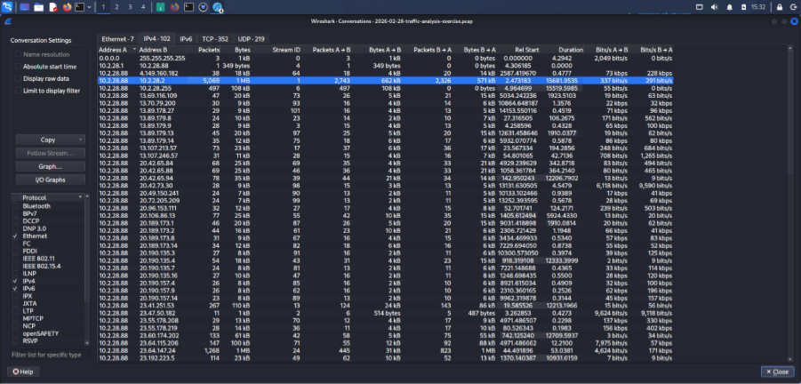

# Easy as 123 — PCAP Traffic Analysis

## Overview

This exercise involved analyzing a network traffic capture file using Wireshark. The objective was to identify important details about a host and understand its network communication.

## Tools Used

- Wireshark
- PCAP file
- Windows network traffic analysis techniques

## Investigation Objectives

- Identify the host IP address
- Find the hostname
- Identify the MAC address
- Identify the Windows user account
- Find the user's full name
- Analyze network conversations and traffic volume

## Findings

| Information | Result |
|---|---|
| IP Address | `10.2.28.88` |
| Hostname | `DESKTOP-TEYQ2NR` |
| MAC Address | `00:19:d1:b2:4d:ad` |
| Windows User Account | `brolf` |
| Full Name | `Becka Rolf` |
| Main Destination IP | `10.2.28.2` |
| Packets Observed | `5,069` |

## Analysis Performed

### 1. IP Address Identification

The Wireshark endpoint information was used to identify the IP address of the host.

### 2. Conversation Analysis

The **Statistics → Conversations** section was used to examine communication between source and destination IP addresses.

### 3. Hostname Identification

The `nbns` display filter was used to identify the hostname associated with the system.

### 4. MAC Address Identification

The Ethernet details of the packets were inspected to identify the MAC address.

### 5. User Account Identification

Relevant Kerberos, NTLM, SMB, and SMB2 packets were examined to identify the Windows user account.

### 6. Full Name Identification

The **Edit → Find Packet** option, using `Ctrl + F`, was used to search for the user's full name within the packet capture.

## Conclusion

This exercise helped me practice identifying host information and analyzing network conversations using Wireshark. It also improved my understanding of how packet captures can be used during network investigation and suspicious traffic analysis.

**Purpose:** This project was completed for cybersecurity learning and controlled lab practice.