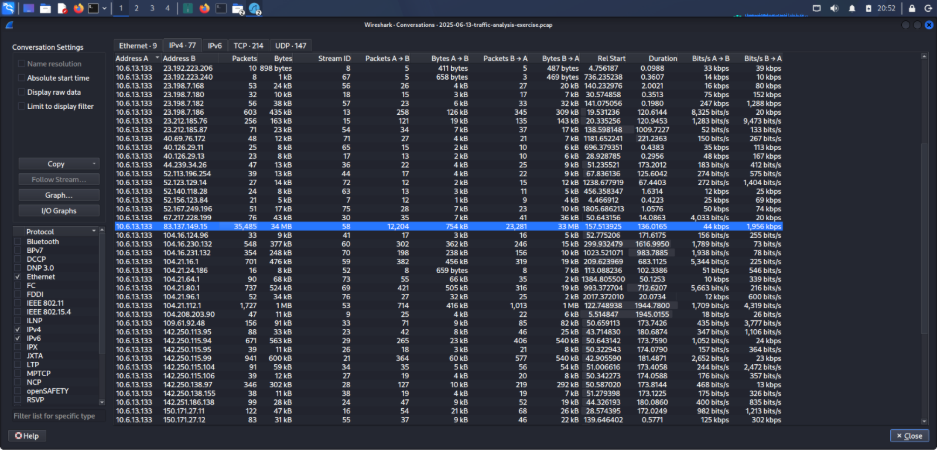

# It's a Trap! — PCAP Traffic Analysis

## Overview

This exercise is based on a PCAP file from the Malware Traffic Analysis platform. The objective was to investigate network traffic using Wireshark and identify the Windows client involved in suspicious activity.

## Tools Used

- Wireshark
- PCAP file
- Malware Traffic Analysis dataset

## Investigation Objectives

The investigation focused on identifying:

- IP address of the Windows client
- MAC address
- Hostname
- Windows user account
- Full name of the user
- Suspicious network activity

## Findings

| Information | Result |
|---|---|
| Client IP | `10.6.13.133` |
| Hostname | `DESKTOP-5AVE44C` |
| MAC Address | `24:77:03:ac:97:df` |
| Windows User | `rgaines` |
| Full Name | `Roman Gaines` |
| Main Destination | `83.137.149.15` |
| Packets Observed | `35,485` |

## Analysis Performed

### 1. Identifying the IP Address

Wireshark's **Statistics → Endpoints** section was used to examine the active hosts in the PCAP.

The host `10.6.13.133` generated significantly higher network traffic compared with the other hosts and was selected for further investigation.

### 2. Analyzing Conversations

The **Statistics → Conversations** section was used to examine communication between hosts.

The main communication identified was:

- Source: `10.6.13.133`
- Destination: `83.137.149.15`
- Packets: `35,485`

### 3. Identifying the Hostname

The `nbns` protocol filter was used to identify the hostname associated with the Windows system.

The hostname identified was:

`DESKTOP-5AVE44`

### 4. Identifying the MAC Address

Ethernet information in Wireshark was examined to identify the MAC address associated with the client.

The MAC address identified was:

`24:77:03:ac:97:df`

### 5. Identifying the Windows User Account

Kerberos, NTLM, SMB, and SMB2 traffic was examined to identify the Windows user account.

The user account identified was:

`rgaines`

The `kerberos.CNameString` field was also used to confirm the username.

### 6. Identifying the Full User Name

Wireshark's **Find Packet** feature was used to search packet details and identify the user's full name.

The full name identified was:

`Roman Gaines`

## Conclusion

This exercise demonstrated how Wireshark can be used to investigate suspicious network traffic and identify important information about a Windows client.

The investigation identified the client's IP address, hostname, MAC address, Windows user account, and full name. Network conversations were also examined to identify the main destination associated with the observed traffic.

## Purpose

This project is part of my cybersecurity learning journey and is intended for educational and authorized security-analysis purposes.