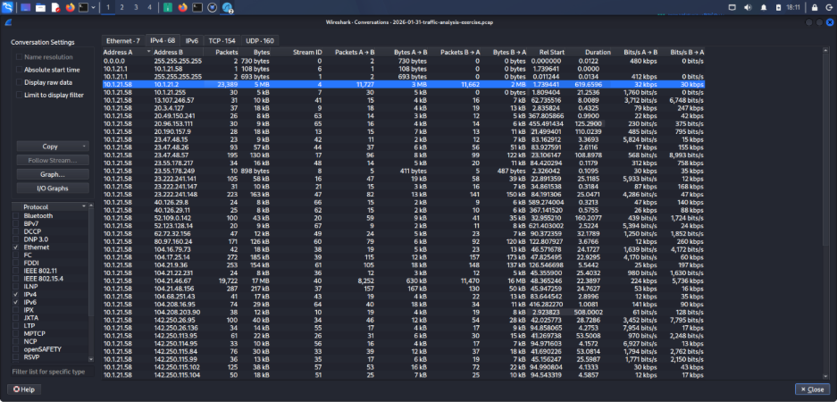

# Lumma in the Room-ah! — PCAP Traffic Analysis

## Overview

This exercise is based on a PCAP file from the Malware Traffic Analysis platform. The goal was to investigate network traffic using Wireshark and identify the Windows client involved in suspicious activity related to **Lumma Stealer**.

## Tools Used

- Wireshark
- PCAP file
- Malware Traffic Analysis dataset

## Investigation Objectives

The investigation focused on identifying:

- IP address of the infected Windows client
- MAC address
- Hostname
- Windows user account
- Full name of the user
- Domain associated with the Lumma Stealer alert

## Findings

| Information | Result |
|---|---|
| Infected Client IP | `10.1.21.58` |
| Hostname | `DESKTOP-ES9F3ML` |
| MAC Address | `00:21:5d:c8:0e:f2` |
| Windows User | `gwyatt` |
| Full Name | `Gabriel Wyatt` |
| Main Destination | `10.1.21.2` |
| Packets Observed | `23,389` |

## Analysis Performed

### 1. Identifying the Infected IP Address

Using **Statistics → Endpoints** in Wireshark, the active hosts in the PCAP were examined.

The host `10.1.21.58` generated significantly higher network traffic compared with the other hosts, making it the main host of interest.

### 2. Analyzing Conversations

The Wireshark **Statistics → Conversations** section was used to examine communication between hosts.

The main communication identified was:

- Source: `10.1.21.58`
- Destination: `10.1.21.2`
- Packets: `23,389`

### 3. Identifying the Hostname

The `nbns` protocol filter was used to identify the hostname associated with the infected Windows system.

The hostname identified was:

`DESKTOP-ES9F3ML`

### 4. Identifying the MAC Address

The Ethernet information in Wireshark was examined to identify the MAC address associated with the host.

The MAC address identified was:

`00:21:5d:c8:0e:f2`

### 5. Identifying the Windows User Account

Kerberos traffic was examined to identify the Windows user account.

The user account identified was:

`gwyatt`

The `kerberos.CNameString` field was also used to confirm the username.

### 6. Identifying the Full User Name

Wireshark's **Find Packet** feature was used to search packet details and identify the user's full name.

The full name identified was:

`Gabriel Wyatt`

## Lumma Stealer Investigation

The PCAP was also investigated for the domain associated with the alert involving the IP address:

`153.92.1[.]49`

The domain can be identified by examining the relevant DNS and network traffic in Wireshark.

> **Note:** The domain name is not included here because it was not provided in the investigation results currently available. It should be added after confirming it from the PCAP analysis.

## Conclusion

This exercise demonstrated how Wireshark can be used to investigate suspicious network traffic and identify important details about a potentially infected Windows system.

The investigation identified the infected client, hostname, MAC address, Windows user account, and full user name. The traffic was then further examined to investigate infrastructure associated with the Lumma Stealer alert.

## Purpose

This project is part of my cybersecurity learning journey and is intended for educational and authorized security-analysis purposes.